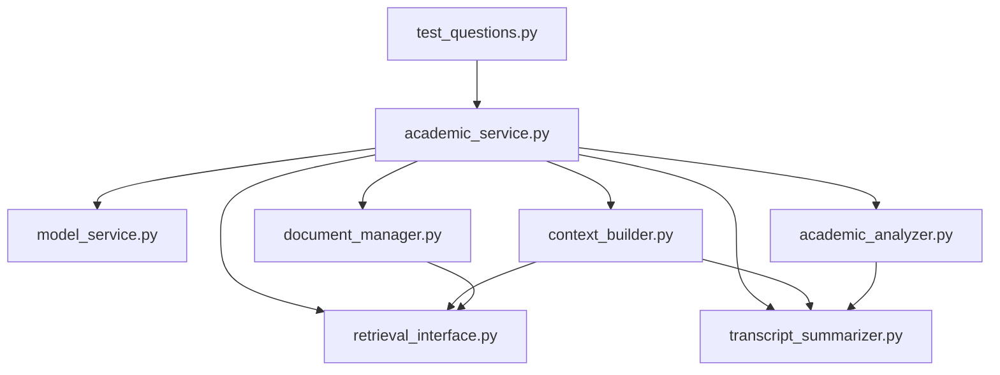

# 📚 Modules - 핵심 컴포넌트

## 📋 개요

이 폴더는 한국어 학사 상담 시스템의 핵심 모듈들을 포함합니다. 

## 🏗️ 모듈 구조

```
📁 modules/
├── academic_service.py        # 🎓 메인 서비스 클래스
├── model_service.py          # 🤖 LLM 모델 서비스
├── context_builder.py        # 📝 컨텍스트 생성기
├── academic_analyzer.py      # 📊 학사 분석기
├── transcript_summarizer.py  # 📋 성적표 요약기
├── document_manager.py       # 📚 문서 관리자
├── retrieval_interface.py    # 🔍 RAG 검색 인터페이스
├── test_questions.py         # 🧪 테스트 질문 모음
└── __init__.py              # 📦 패키지 초기화
```

## 🔧 핵심 모듈 상세

### 1. 🎓 **academic_service.py**
**메인 서비스 클래스 - 시스템의 중심**

```python
class AcademicCounselingService:
    """학사 상담 서비스 메인 클래스"""
```

**주요 기능:**
- 모든 컴포넌트 통합 관리
- 사용자 질문 처리 및 응답 생성
- 시스템 상태 모니터링
- 리소스 관리 및 정리

**핵심 메서드:**
- `ask_question(user_question)`: 질문 처리 및 답변 생성
- `get_system_status()`: 시스템 상태 확인
- `reload_transcript_data()`: 성적표 데이터 재로드
- `cleanup()`: 리소스 정리

### 2. 🤖 **model_service.py**
**LLM 모델 서비스 - AI 모델 관리**

```python
class ModelService:
    """LLM 모델 로딩 및 관리"""
```

**주요 기능:**
- LLM 모델 로딩 및 초기화
- GPU/CPU 자동 감지 및 최적화
- 응답 생성 및 품질 관리
- 메모리 효율적 모델 관리

**핵심 메서드:**
- `load_model()`: 모델 로딩
- `generate_response()`: 응답 생성
- `get_model_info()`: 모델 정보 조회
- `cleanup()`: 모델 메모리 해제

### 3. 📝 **context_builder.py**
**컨텍스트 생성기 - 프롬프트 최적화**

```python
class ContextBuilder:
    """질문별 맞춤 컨텍스트 생성"""
```

**주요 기능:**
- 질문 분석 및 키워드 추출
- RAG 검색 결과 통합
- 프롬프트 길이 최적화
- 한국어 전용 프롬프트 생성

**핵심 메서드:**
- `create_full_context()`: 전체 컨텍스트 생성
- `expand_search_queries()`: 검색 키워드 확장
- `create_basic_transcript_summary()`: 성적표 기본 요약
- `deduplicate_documents()`: 중복 문서 제거

### 4. 📊 **academic_analyzer.py**
**학사 분석기 - 졸업 요건 분석**

```python
class AcademicAnalyzer:
    """학사 규정 및 졸업 요건 분석"""
```

**주요 기능:**
- 졸업 요건 자동 분석
- 학점 계산 및 통계
- 미충족 요건 식별
- 수강 계획 추천

**핵심 메서드:**
- `analyze_graduation_requirements()`: 졸업 요건 분석
- `calculate_gpa_statistics()`: 평점 통계 계산
- `identify_missing_requirements()`: 미충족 요건 식별
- `recommend_courses()`: 추천 과목 제시

### 5. 📋 **transcript_summarizer.py**
**성적표 요약기 - 데이터 구조화**

```python
class TranscriptSummarizer:
    """성적표 데이터 요약 및 구조화"""
```

**주요 기능:**
- 성적표 데이터 파싱
- 학기별 문서 생성
- RAG 데이터 구조화
- 성적 패턴 분석

**핵심 메서드:**
- `create_multiple_rag_docs()`: 다중 RAG 문서 생성
- `create_individual_semester_doc()`: 학기별 문서 생성
- `extract_grade_patterns()`: 성적 패턴 추출
- `create_basic_summary()`: 기본 요약 생성

### 6. 📚 **document_manager.py**
**문서 관리자 - RAG 데이터 관리**

```python
class DocumentManager:
    """RAG 문서 로딩 및 관리"""
```

**주요 기능:**
- RAG 데이터셋 로딩
- 문서 메타데이터 관리
- 문서 검색 및 필터링
- 데이터 품질 관리

**핵심 메서드:**
- `load_rag_dataset()`: RAG 데이터셋 로딩
- `get_documents()`: 문서 조회
- `add_documents()`: 문서 추가
- `get_document_info()`: 문서 정보 조회

### 7. 🔍 **retrieval_interface.py**
**RAG 검색 인터페이스 - 의미 기반 검색**

```python
class SemanticRetrievalInterface:
    """의미 기반 문서 검색 인터페이스"""
```

**주요 기능:**
- 의미 기반 문서 검색
- 임베딩 벡터 관리
- 검색 결과 순위 매기기
- 검색 성능 최적화

**핵심 메서드:**
- `search()`: 문서 검색
- `add_documents()`: 문서 추가
- `build_index()`: 검색 인덱스 구축
- `get_similarity_scores()`: 유사도 점수 계산

### 8. 🧪 **test_questions.py**
**테스트 질문 모음 - 시스템 검증**

```python
TEST_QUESTIONS = {
    "level_1": [...],  # 기본 정보 조회
    "level_2": [...],  # 학기별 단순 조회
    "level_3": [...],  # 학기별 비교 분석
    "level_4": [...],  # 복합 분석 및 계산
    "level_5": [...],  # 예측 및 계획 수립
    "general": [...]   # 일반 질문
}
```

**주요 기능:**
- 레벨별 테스트 질문 제공
- 시스템 성능 검증
- 회귀 테스트 지원
- 질문 유형별 분류

## 🔄 모듈 간 상호작용



## 🚀 사용 방법

### 기본 사용법

```python
from modules.academic_service import create_academic_service

# 서비스 초기화
service = create_academic_service()

# 질문 처리
response = service.ask_question("질문 내용")
print(response)

# 정리
service.cleanup()
```

### 개별 모듈 사용

```python
# 학사 분석기만 사용
from modules.academic_analyzer import AcademicAnalyzer

analyzer = AcademicAnalyzer()
result = analyzer.analyze_graduation_requirements(transcript_data)

# 컨텍스트 빌더만 사용
from modules.context_builder import create_context_builder

builder = create_context_builder()
context = builder.create_full_context(question, data, rag_func)
```

## 🔧 설정 및 커스터마이징

### 모델 설정

```python
# 기본 설정
service = create_academic_service()

# 커스텀 모델 경로
service = create_academic_service(model_path="/path/to/model")
```

### RAG 검색 설정

```python
# 검색 파라미터 조정
from modules.retrieval_interface import create_semantic_retrieval_interface

retrieval = create_semantic_retrieval_interface()
docs = retrieval.search(query="질문", k=10, max_doc_length=1500)
```

### 컨텍스트 빌더 설정

```python
# 프롬프트 커스터마이징
from modules.context_builder import create_context_builder

builder = create_context_builder()
context = builder.create_full_context(
    user_question=question,
    transcript_data=data,
    rag_search_func=search_func,
    include_semester_details=False  # 상세 정보 포함 여부
)
```

## 📊 성능 최적화

### 메모리 관리

```python
# 정기적인 정리
service.cleanup()

# 모델 메모리 해제
service.model_service.cleanup()
```

### 검색 성능

```python
# 인덱스 최적화
retrieval_interface.build_index()

# 캐시 활용
retrieval_interface.enable_cache()
```

## 🧪 테스트

### 단위 테스트

```python
# 개별 모듈 테스트
python -m pytest modules/test_academic_analyzer.py
python -m pytest modules/test_context_builder.py
```

### 통합 테스트

```python
# 전체 시스템 테스트
python modules/academic_service.py
```

### 성능 테스트

```python
# 응답 시간 측정
import time
start = time.time()
response = service.ask_question(question)
print(f"처리 시간: {time.time() - start:.2f}초")
```

## 🐛 디버깅

### 로그 설정

```python
import logging
logging.basicConfig(level=logging.DEBUG)

# 모듈별 로그 확인
logger = logging.getLogger('modules.academic_service')
logger.debug("디버그 메시지")
```

### 상태 확인

```python
# 시스템 상태 모니터링
status = service.get_system_status()
print(f"시스템 상태: {status}")

# 개별 컴포넌트 상태
print(f"모델 상태: {service.model_service.is_loaded()}")
print(f"RAG 상태: {service.retrieval_interface.is_ready()}")
```

## 📈 확장 가능성

### 새로운 모듈 추가

```python
# 새로운 분석 모듈
class AdvancedAnalyzer:
    def __init__(self):
        pass
    
    def analyze_trends(self, data):
        # 고급 분석 로직
        pass
```

### 기존 모듈 확장

```python
# 컨텍스트 빌더 확장
class EnhancedContextBuilder(ContextBuilder):
    def create_specialized_context(self, question_type):
        # 특화된 컨텍스트 생성
        pass
```

## 📞 지원

### 문제 해결
- 각 모듈의 docstring 참조
- 로그 메시지 확인
- 상태 정보 점검

### 기여 방법
- 코드 스타일 가이드 준수
- 단위 테스트 작성
- 문서화 업데이트

---

**🔧 모듈화된 설계로 유연하고 확장 가능한 학사 상담 시스템을 구축했습니다.**